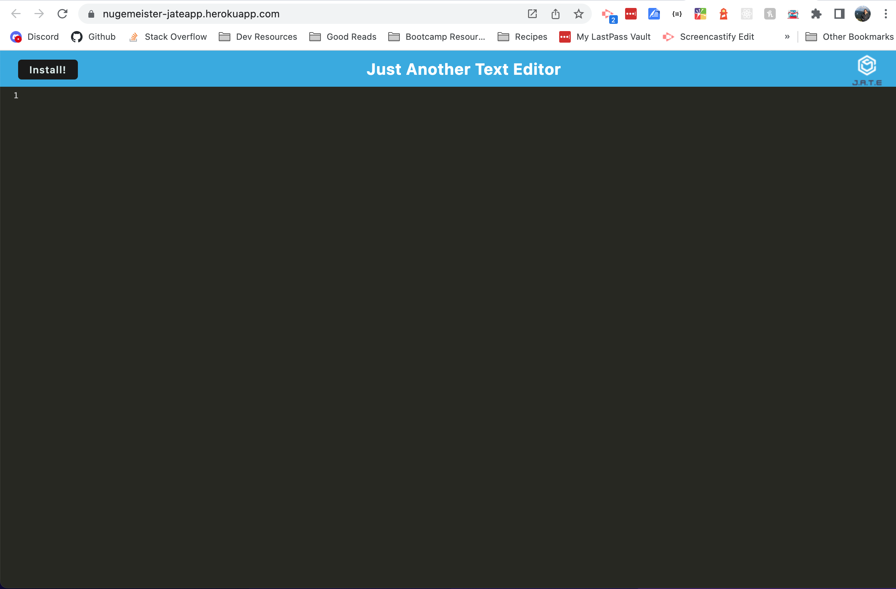

# Text Editor

## Project Explained
The purpose of this project is to create a text editor that runs in the browser via a single-page application leveraging PWAs.

<br></br>

---

## Success Criteria

### User Stories
```
AS A developer
I WANT to create notes or code snippets with or without an internet connection
SO THAT I can reliably retrieve them for later use

```
### Acceptance Criteria
```
GIVEN a text editor web application
WHEN I open my application in my editor
THEN I should see a client server folder structure
WHEN I run `npm run start` from the root directory
THEN I find that my application should start up the backend and serve the client
WHEN I run the text editor application from my terminal
THEN I find that my JavaScript files have been bundled using webpack
WHEN I run my webpack plugins
THEN I find that I have a generated HTML file, service worker, and a manifest file
WHEN I use next-gen JavaScript in my application
THEN I find that the text editor still functions in the browser without errors
WHEN I open the text editor
THEN I find that IndexedDB has immediately created a database storage
WHEN I enter content and subsequently click off of the DOM window
THEN I find that the content in the text editor has been saved with IndexedDB
WHEN I reopen the text editor after closing it
THEN I find that the content in the text editor has been retrieved from our IndexedDB
WHEN I click on the Install button
THEN I download my web application as an icon on my desktop
WHEN I load my web application
THEN I should have a registered service worker using workbox
WHEN I register a service worker
THEN I should have my static assets pre cached upon loading along with subsequent pages and static assets
WHEN I deploy to Heroku
THEN I should have proper build scripts for a webpack application

```

<br></br>

## Usage

### Visit Deployed Application
1. Visit the deployed application [here](https://nugemeister-jateapp.herokuapp.com/).
2. You are able to use the main window to live-edit text within the application. Any edits you make will be saved as you go.
3. For offline use, click the `install` button at the top-left of the page!

### Use Locally
1. Clone the repository onto your local machine using the `git clone` command.
2. While in the root directory, run `npm install` to install necessary packages and dependencies.
3. While in the root directory, enter the command `npm run start` to initialize the application locally.
4. Navigate to http://localhost:3000 and follow the same steps listed above.

<br></br>
## Deployed Application
> The following screenshot shows the appearance of the deployed web application.

[

---

[Top of Page](#text-editor)